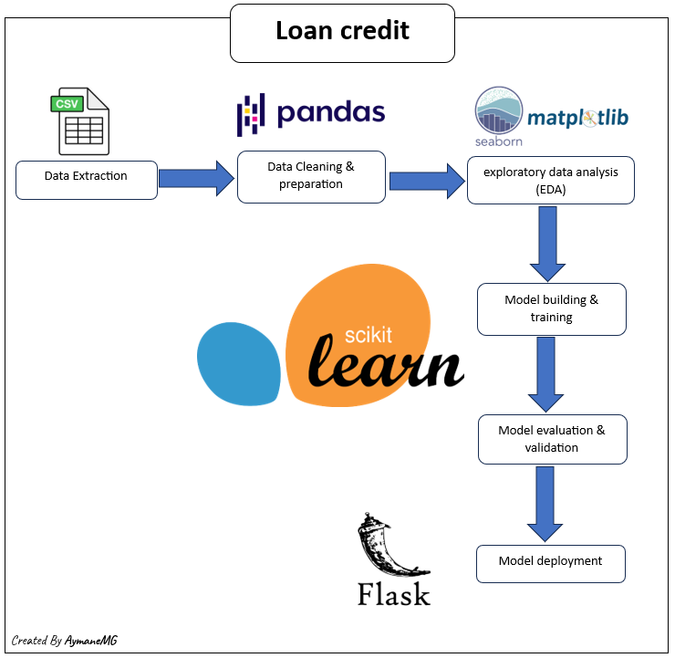

# Loan Credit Classification using Logistic Regression

This project aims to develop a machine learning model using Logistic Regression for classifying loan credit applications as either approved or rejected. Additionally, it includes a Flask web application for deploying the trained model.

## Table of Contents

- [Project Overview](#project-overview)
- [Installation](#installation)
- [Usage](#usage)

## Project Overview

In this project, we leverage the power of Logistic Regression, a widely used classification algorithm, to predict the likelihood of loan credit approval based on various features such as income, credit history, employment status, and more.

The project repository includes the following components:

- `Loan_Credit_App/`: This directory contains the source code files for the flask web application.
- `dataset.csv/`: the dataset used for training and testing the model.
- `model.pkl`: The serialized trained Logistic Regression model.
- `app.py`: The Flask application for deploying the trained model.
- `requirements.txt`: A list of Python dependencies required to run the project.
- `Loan Credit.ipynb` : The jupyter Notebook for building the model.
  
The machine learning model builded is follow the following architecture :

---

---

## Installation

To set up the project environment, follow these steps:

1. Clone the repository:

`git clone https://github.com/your-username/loan-credit-classification.git`

2. Navigate to the project directory:

`cd Loan-credit`

3. Install the dependencies:

`pip install -r requirements.txt`

## Usage
Run the Flask application:

`python app.py`

Open your web browser and go to http://localhost:5000.
you will be aable to see the 
you will able to see this UI (user interface)

---

---
Fill in the loan application details and click the "Predict" button.
The application will display the predicted loan credit decision as either approved or rejected.

Feel free to customize the contents of the `README.md` file according to your specific project details and requirements.

